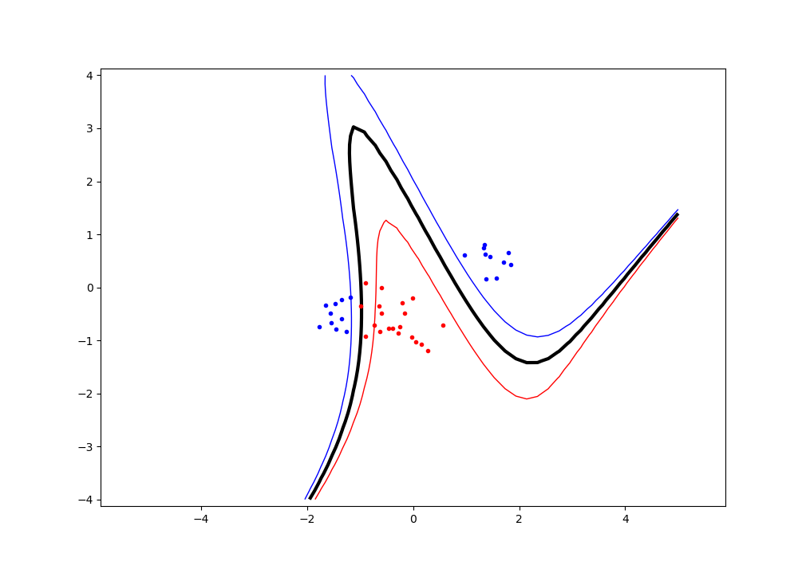

## 1. Move the clusters around and change their sizes to make it easier or harder for the classifier to find a decent boundary. Pay attention to when the optimizer (minimize function) is not able to find a solution at all.

Visible seperation:

Non distinguishable dataset:

## 2. Implement the two non-linear kernels. You should be able to classify very hard data sets with these.

Dataset is considered to be hard
Linear Kernel:

RBF Kernel (sigma = 2):

Polynomial Kernel (P = 3)

## 3. The non-linear kernels have parameters; explore how they influence the decision boundary. Reason about this in terms of the biasvariance trade-off.

Polynomial Kernel (P = 3)

Polynomial Kernel (P = 8)

The higher the parameter, the more complex the boundary becomes, thus increasing the variance, while decreasing the bias. The lower the parameter, the 'less' complex the boundary becomes, thus increasing the bias, while decreasing the variance.

RBF Kernel (sigma = 2):

RBF Kernel (sigma = 15):

RBF Kernel (sigma = 50):

RBF Kernel (sigma = 100):

As the sigma parameter increases, the boundary becomes more smooth, therefore if a very high sigma value is applied the boundary will aproach a straight line (while decreasing the complexity), so the variance decreases, and the bias increases. While the sigma value becomes smaller, the variance increases, and the bias decreases.
## 4. Explore the role of the slack parameter C. What happens for very large/small values?

Polynomial Kernel (P = 3) and C = None 

Polynomial Kernel (P = 3) and C = 1 

C = slack variable.
Slack variables are introduced to allow certain constraints to be violated. That is, certain training points will be allowed to be within the margin.

For lower values of C, the margin of the boundary increases as it allows for more noise. For larger values of C, the margin of the boundary decreases as it allows less noisy datapoints.

## 5. Imagine that you are given data that is not easily separable. When should you opt for more slack rather than going for a more complex model (kernel) and vice versa?

For low dimension data, is it feasible to visually represent the dataset, thus allowing to choose the more accurate kernel based on the visualization. For example, if the data seems to be linearly separable, you wouldn't necesarily need to use a polynomial/rbf kernel (a more complex kernel), and in the case that the dataset has visible outliers you could potentially modify the slack variable to tolerate such noise.
For higher or more complex data, most likely it would be better to first choose a more sophisticated kernel (like rbf or polynomial). In that scenario, the slack variable would not be as useful given the visual complexity of the dataset, thus making it more difficult to test the different values for the slack variable.

For crtical applications, which do not allow for 'miscalculations' (such as medicine), it would be better to use a more complex kernel.
For simple applications, like 'is it a cat or a dog', the miscalculations will not have as severe effects.

For the best model, it is beneficial to try out all the available options, and decide on the best proportions between the complexity of the kernel and the value of the slack variable (bias and variance tradeoff).